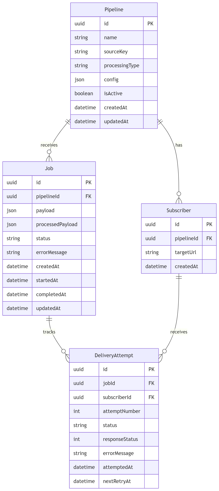
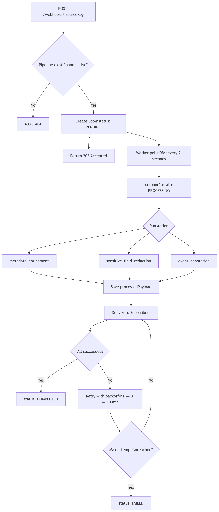
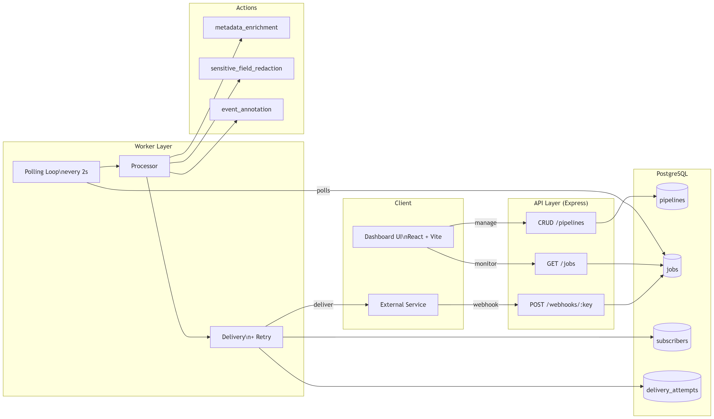
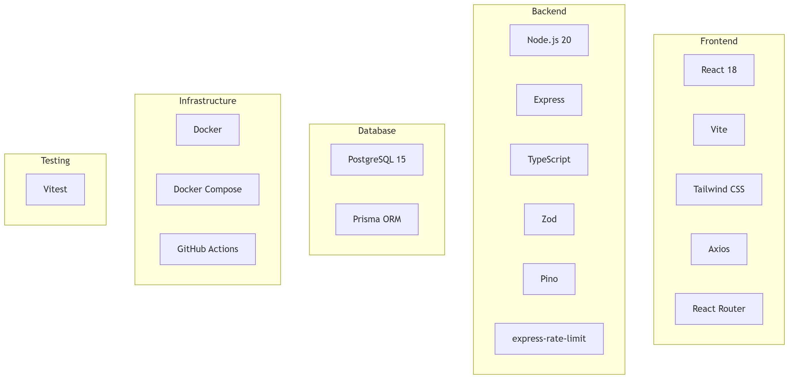

# Webhook Pipeline

A webhook-driven task processing service built with TypeScript, PostgreSQL, and Docker.
Inspired by tools like Zapier — inbound events trigger processing actions, and results are delivered to registered subscribers.

---

## What It Does

You create a **pipeline** that connects three things:

1. **A source** — a unique URL that accepts incoming webhooks
2. **A processing action** — a transformation applied to the incoming data
3. **Subscribers** — one or more URLs that receive the processed result

When a webhook hits a pipeline's source URL, it is queued as a background job. A worker picks it up, runs the action, and delivers the result to all subscribers — with automatic retry on failure.

---

## Tech Stack

| Layer | Technology |
|---|---|
| Language | TypeScript |
| Framework | Express |
| Database | PostgreSQL via Prisma ORM |
| Validation | Zod |
| HTTP Client | Axios |
| Logging | Pino |
| Testing | Vitest |
| Container | Docker + Docker Compose |
| CI/CD | GitHub Actions |
| Dashboard | React + Vite + Tailwind CSS |

---

## Project Structure
```
src/
├── api/           # Express route handlers (pipelines, webhooks, jobs)
├── worker/        # Background job processor and delivery logic
├── actions/       # Processing action implementations
├── middleware/    # Rate limiting
├── schemas/       # Zod validation schemas
├── types/         # TypeScript interfaces and shared constants
├── lib/           # Shared clients (Prisma, Axios, Pino)
├── app.ts         # Express app setup
├── server.ts      # API entry point
└── worker.ts      # Worker entry point

dashboard/         # React dashboard (Vite + Tailwind)
prisma/            # Database schema and migrations
```

---

## Processing Actions

Three action types are available when creating a pipeline:

### `metadata_enrichment`
Adds a `_metadata` block to every payload with processing timestamp and source.
```json
// Input
{ "event": "order_created", "customer": "Ali" }

// Output
{
  "event": "order_created",
  "customer": "Ali",
  "_metadata": {
    "processedAt": "2026-03-15T10:00:00.000Z",
    "processedBy": "webhook-pipeline"
  }
}
```

### `sensitive_field_redaction`
Replaces sensitive field values with `[REDACTED]`. Works recursively on nested objects and arrays. Default fields: `password`, `token`, `secret`, `creditCard`, `ssn`, `apiKey`. Configurable via pipeline `config`.
```json
// Input
{ "user": "Ali", "password": "secret123", "token": "abc" }

// Output
{ "user": "Ali", "password": "[REDACTED]", "token": "[REDACTED]" }
```

### `event_annotation`
Analyzes the event type, determines a mood (`success`, `warning`, `info`), and appends an `_annotation` block with a human-readable message.
```json
// Input
{ "eventType": "build_failed", "service": "payments-api" }

// Output
{
  "eventType": "build_failed",
  "service": "payments-api",
  "_annotation": {
    "tag": "system-event",
    "mood": "warning",
    "message": "Build tripped over its own shoelaces.",
    "annotatedAt": "2026-03-15T10:00:00.000Z"
  }
}
```

---

## Getting Started

### Prerequisites
- Docker Desktop
- Node.js 20+

### Run with Docker Compose
```bash
docker compose up --build
```

This starts three services:
- `db` — PostgreSQL database
- `migrate` — runs Prisma migrations then exits
- `api` — Express API on port 3000
- `worker` — background job processor
- `dashboard` — React dashboard on port 5173

| Service | URL |
|---|---|
| API | http://localhost:3000 |
| Dashboard | http://localhost:5173 |

### Run locally for development
```bash
# 1. Start the database
docker compose up -d db

# 2. Install dependencies
npm install

# 3. Run migrations
npx prisma migrate deploy

# 4. Start the API
npx ts-node src/server.ts

# 5. Start the worker (separate terminal)
npx ts-node src/worker.ts

# 6. Start the dashboard (separate terminal)
cd dashboard && npm install && npm run dev
```

Dashboard is available at `http://localhost:5173`

---

## API Reference

### Pipelines

| Method | Endpoint | Description |
|---|---|---|
| `GET` | `/pipelines` | List all pipelines |
| `GET` | `/pipelines/:id` | Get a pipeline by ID |
| `POST` | `/pipelines` | Create a pipeline |
| `PATCH` | `/pipelines/:id` | Update a pipeline |
| `DELETE` | `/pipelines/:id` | Delete a pipeline |

**Create pipeline request body:**
```json
{
  "name": "Order Events",
  "processingType": "metadata_enrichment",
  "subscribers": ["https://your-endpoint.com/webhook"],
  "config": {}
}
```

**Response includes `webhookUrl`:**
```json
{
  "success": true,
  "data": {
    "id": "...",
    "sourceKey": "abc123",
    "webhookUrl": "/webhooks/abc123"
  }
}
```

### Webhooks

| Method | Endpoint | Description |
|---|---|---|
| `POST` | `/webhooks/:sourceKey` | Send a webhook to a pipeline |

Returns `202 Accepted` immediately. Processing happens in the background.

### Jobs

| Method | Endpoint | Description |
|---|---|---|
| `GET` | `/jobs` | List jobs (supports `?status=`, `?page=`, `?limit=`) |
| `GET` | `/jobs/:id` | Get job details with delivery attempts |
| `GET` | `/jobs/:id/deliveries` | Get delivery attempts for a job |

### Health

| Method | Endpoint | Description |
|---|---|---|
| `GET` | `/health` | Service health check |

---

## Architecture

### Job Lifecycle
```
POST /webhooks/:sourceKey
        │
        ▼
   Job created (PENDING)
        │
        ▼
   Worker picks up job
        │
        ▼
   status → PROCESSING
        │
        ▼
   Action runs on payload
        │
        ▼
   Deliver to subscribers
        │
   ┌────┴────┐
   ▼         ▼
 All OK    Any failed
   │         │
COMPLETED  FAILED
```

### Retry Logic

Failed deliveries are retried with increasing delays:
```
Attempt 1 fails → wait 1 minute
Attempt 2 fails → wait 2 minutes
Attempt 3 fails → wait 3 minutes
Attempt 4 fails → mark as dead, stop retrying
```

Every attempt is recorded in `delivery_attempts` with the HTTP status code and error message.

### Database Schema

Four tables:

- **pipelines** — pipeline configuration and source key
- **subscribers** — delivery target URLs (one pipeline → many subscribers)
- **jobs** — every incoming webhook stored as a job with full lifecycle tracking
- **delivery_attempts** — every delivery try per subscriber with retry timestamps

Cascade deletes are set on all foreign keys — removing a pipeline removes all related data.

---

## Stretch Goals Implemented

### Rate Limiting
API endpoints are protected with `express-rate-limit`:
- General API: 100 requests per 15 minutes per IP
- Webhook ingestion: 30 requests per minute per IP

### Dashboard UI
A React dashboard at `http://localhost:5173` that fully replaces manual API testing:
- Create, view, activate/deactivate, and delete pipelines
- Send test webhooks directly from the UI
- Monitor job status with live auto-refresh
- Inspect processed payloads and delivery attempts

---
## Architecture Diagrams

### Entity Relationship Diagram


### Job Lifecycle


### System Architecture


### Tech Stack

---
## Design Decisions

**DB polling instead of a message queue**
A simple polling loop (every 2 seconds) replaces Redis or RabbitMQ. Sufficient for this scale and keeps the infrastructure minimal — one `docker compose up` is all that's needed.

**Synchronous retry delays**
Retries block the worker loop during the wait period. This is intentional for simplicity. A production improvement would be scheduling retries asynchronously so other pending jobs are not blocked.

**Separate migrate service in Docker**
Rather than running migrations inside the API container, a dedicated `migrate` service runs `prisma migrate deploy` and exits before the API and worker start. This ensures clean separation and prevents race conditions.

**PATCH instead of PUT for pipeline updates**
All pipeline update fields are optional, making it a partial update by definition. PATCH is semantically correct here.

**sourceKey instead of full URL**
Pipelines store only the random key portion of the webhook URL (`/webhooks/:sourceKey`). The full URL is constructed at runtime, making it easy to change the domain or port without a database migration.

---

## Running Tests
```bash
npm test
```

10 unit tests covering all three processing actions — field preservation, redaction, mood detection, and config overrides.

---

## CI/CD

GitHub Actions runs on every push to `main`:

1. Install dependencies
2. Generate Prisma client
3. TypeScript type check
4. Run database migrations
5. Run tests
6. Build
